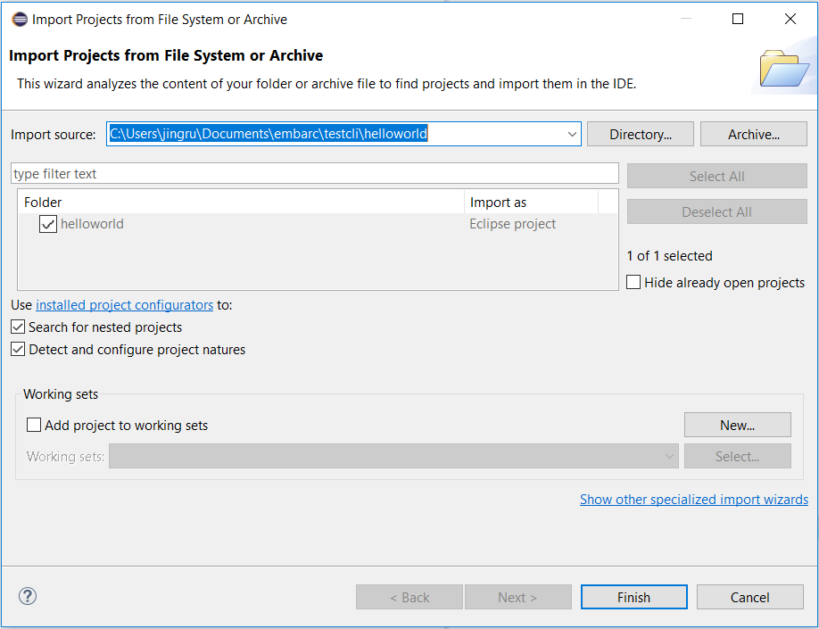
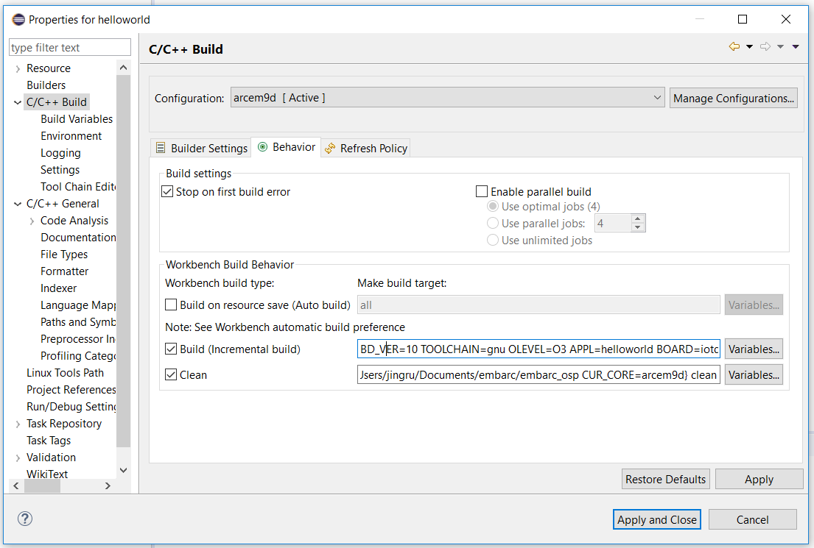
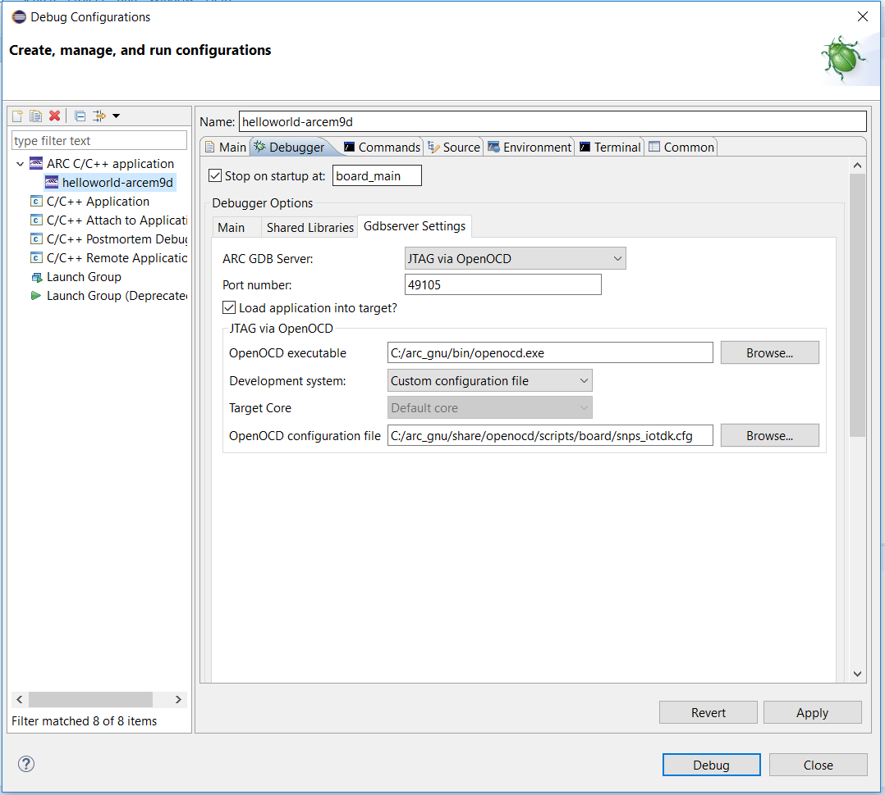
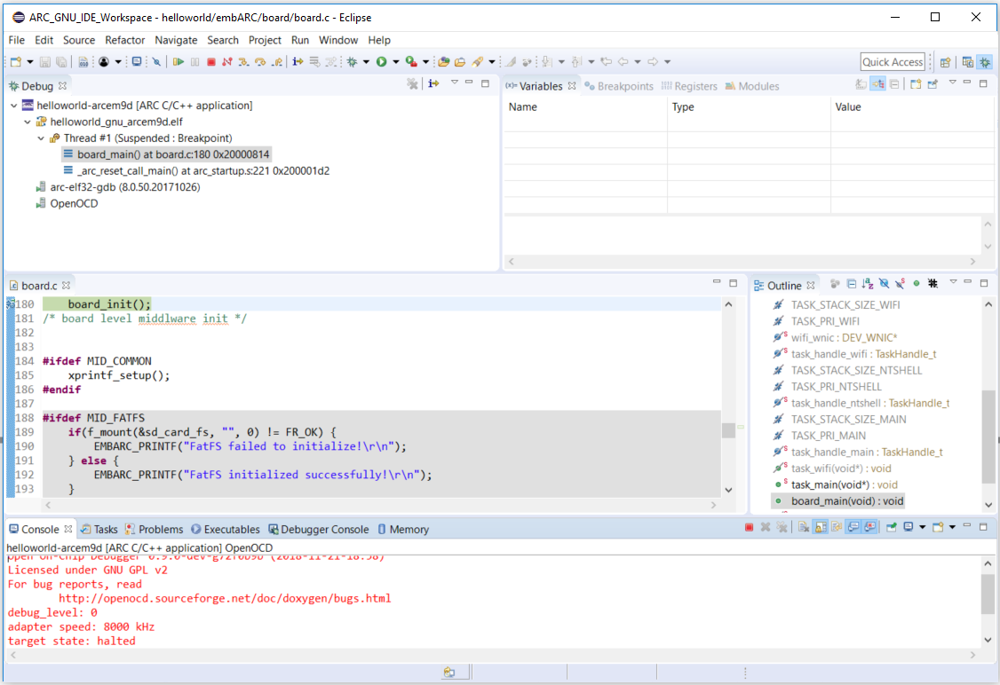

[](https://travis-ci.com/foss-for-synopsys-dwc-arc-processors/embarc_tools) [](https://pypi.org/project/embarc_cli/) [](https://pypi.org/project/embarc_cli/)
## Introduction
embARC CLI is the name of the embARC command-line tool, packaged as `embarc_tools`. embARC CLI support for embARC application creation, build and config, use of the embARC Open Software Platform.

This document covers the installations and usage of embARC CLI.
## Usage
The basic workflow for embARC CLI is to:
1. Create an application.
2. Config the application.
3. Build the application code.

<span class="tips">**Tip:** To list all embARC CLI commands, use `embarc --help`. A detailed command-specific help is available by using `embarc <command> --help`.
```
$ embarc -h
usage: embarc [-h] [--version]             ...

            Command-line tool for embARC OSP - https://embarc.org/embarc_osp

            version 1.1.0

Use "embarc <command> -h|--help" for detailed help.

            Online manual and guide available at https://github.com/foss-for-synopsys-dwc-arc-processors/embarc_tools

optional arguments:
  -h, --help   show this help message and exit
  --version    Display version

Commands:

    appconfig  Get or set application config
    build      Build application
    config     Get, set or unset configuration options.
    new        Create a new application
```
### Installation
Windows and Linux support for embARC CLI.

### Requirements
* **Python** - embARC CLI is a Python script, so you'll need Python to use it. We test embARC CLI with [version 2.7.11 of Python](https://www.python.org/downloads/release/python-2711/) and [version 3.6.0 of Python](https://www.python.org/downloads/release/python-360/)
#### Install embARC CLI
You can get the lastest stable version of embARC CLI through pip by running:
```
$ pip install embarc-cli
```
Alternatively, you can get the development version of embARC CLI by cloning the development repository:
```
$ git clone https://github.com/foss-for-synopsys-dwc-arc-processors/embarc_tools.git
```
Once cloned, you can install embARC CLI as a Python package:
```
$ python setup.py build
$ python setup.py install
```
#### Update embARC CLI
To update an existing installation of embARC CLI, run:
```
$ pip install -U embarc-cli
```
#### Uninstall embARC CLI
```
$ pip uninstall embarc-cli
```
### Before you begin
embARC CLI uses the user directory `Users/xxx/.embarc_cli` to save global settings. When you use embARC CLI, it will create two files:
1. `Users/xxx/.embarc_cli/osp.json` including information about root paths of embARC OSP source code.
2. `Users/xxx/.embarc_cli/global_config.json` including current global settings: `EMBARC_ROOT`,`TOOLCHAIN` and build configuration `BOARD`, `BD_VER` and `CUR_CORE`.
### Create a new application
embARC CLI can create applications based on embARC Open Software Platform. A detailed command-specific help is available by using `embarc new --help`.

When you create a new application, embARC CLI automatically imports the OSP from global settings if you haven't specify a OSP root path by `--embarc-root`, if there is no `EMBARC_ROOT` in global settings, you need to input manually.

The arguments for `build` are:

- `-d` or `--directory` to specify the path of the application.
- `-b` or `--board` to select a board.
- `--bd-ver` to select a board_ver.
- `--core` to select a core.
- `-t` or `--toolchain` to select a toolchain. The value can be `gnu`(GNU) or `mw`(MetaWare).
- `--target` to select the build target, the default target is `all`, you can selsect one from `[elf, bin, hex, size, opt, info, all, run, clean]`.
- `-g` or `--export` to generate Eclipse IDE project file for your application.
- `--config` to specify application configuration with a json file, default is to look for build.json in build directory or source directory.
- `--build-opt` to pass extra configurations to make command.

Let's create an application named `helloworld` for embARC OSP:
```
$ embarc new --directory helloworld
INFO    - application: helloworld in C:/Users/jingru/Documents/conda/helloworld
INFO    - embarc_root: C:/Users/jingru/Documents/git/github/embarc_osp
INFO    - toolchain: gnu
INFO    - please choose board from axs emsdp emsk hsdk iotdk nsim
choose board: emsk
INFO    - please choose board version from 11 22 23
choose version: 23
INFO    - please choose board core from arcem7d arcem7d_em6 arcem11d_em7d arcem7d_em4 arcem9d arcem7d_em5d arcem11d arcem9d_em5d
choose version: arcem9d
INFO    - platform: <emsk version 23 core arcem9d on arc>
INFO    - cache build config into C:/Users/jingru/Documents/conda/helloworld/build.json
INFO    - finish to genrate application
```

<span class="tips">**Tip:** If you haven't set a global `EMBARC_ROOT`, it will raise `Can't get osp root from global setting`.
When you create application with `embarc new`, it will generate a file `build.json` recording the parameters:
```
{
    "APPL": "helloworld",
    "EMBARC_ROOT": "C:/Users/jingru/Documents/git/github/embarc_osp",
    "TOOLCHAIN": "gnu",
    "BOARD": "emsk",
    "BD_VER": "23",
    "CUR_CORE": "arcem9d"
}
```

### Build your application
Use the `embarc build` command to compile your code:
```
$ embarc build -d helloworld
INFO    - setting up build configurations ...
INFO    - application: C:\Users\jingru\Documents\conda\helloworld
INFO    - get cached config from helloworld\build.json
INFO    - embARC root: C:/Users/jingru/Documents/git/github/embarc_osp
INFO    - platform: <emsk version 23 core arcem9d on arc>
INFO    - toolchain: gnu
INFO    - build target: all
INFO    - start to build application

make: Entering directory 'C:/Users/jingru/Documents/conda/helloworld'
"Creating Directory    : " C:/Users/jingru/Documents/conda/build-out/obj_emsk_23/gnu_arcem9d/application/.
"Creating Directory    : " C:/Users/jingru/Documents/conda/build-out/obj_emsk_23/gnu_arcem9d/arc
...
"Linking               : " C:/Users/jingru/Documents/conda/build-out/obj_emsk_23/gnu_arcem9d/helloworld_gnu_arcem9d.elf
make: Leaving directory 'C:/Users/jingru/Documents/conda/helloworld'

INFO    - command completed in: (30.422908544540405)s
INFO    - rom total: 27220       ram total: 12296
```

#### Export Eclipse IDE file
If you need to debug your code, you can export your source tree to IDE project file to use the IDE's debugging facilities. embARC CLI supports exporting to Eclipse using GNU or MetaWare.

For example:
```
$ embarc build  -d helloworld --export
INFO    - setting up build configurations ...
INFO    - application: C:\Users\jingru\Documents\conda\helloworld
INFO    - get cached config from helloworld\build.json
INFO    - embARC root: C:/Users/jingru/Documents/git/github/embarc_osp
INFO    - platform: <emsk version 23 core arcem9d on arc>
INFO    - toolchain: gnu
INFO    - generating esclipse project description file ...
INFO    - generating esclipse cdt into .cproject file ...
INFO    - generating esclipse launch configuration file ...
INFO    - open Eclipse - >File >Open Projects from File System >Paste
C:/Users/jingru/Documents/conda/build-out
```
- Open **ARC GNU IDE 2018.09 Eclipse**, click **File -> Open Projects from File System** .
- Paste `C:/Users/jingru/Documents/conda/build-out` to **Import source**, and click **Finish**.You can your project in **Project Explorer** view.

  

- From the **Project Explorer** view, right-click the project name `helloworld`, select **Properitise** and click **C/C++ Build**, you can see the build settings.

  
  
  Click **C/C++ General -> Paths and Symbols**.
  
  

- Click the **Run > Debug Configurations...** menu option. The Debug Configurations dialog opens.
- Click **helloworld-arcem9d**, you can see that data is automatically entered, take a moment to verify its accuracy or change as needed.
  
  

- Click **Debug**. You may be prompted to switch to the Debug perspective. Click **Yes**.

  

### embARC CLI configuration
The embARC CLI provides a flexible mechanism for configuring the embARC program. You can use it to set, get, update or unset embARC build configuration options. These options can be global or local (per program).

#### Global configuration
Currently supported options: `osp`, `toolchain`, `build_cfg`. A detailed command-specific help is available by using `embarc config --help`.

You can use `embarc config osp` to config the `EMBARC_ROOT`.
The commands for `embarc config osp` are:

- `embarc config osp --add <name> -m <url> --mr <rev> [<dest>]` to clone osp repository from remote url.
- `<name> --local [<dest>]` to add local existing osp directory.
- `embarc config osp --rename <oldname> <newname>` to rename a `EMBARC_ROOT`.
- `embarc config osp --remove <name>` to remove the path from `osp.json`.
- `embarc config osp --list` to show all recorded paths.
- `embarc config osp --set <name>` to set a path as global `EMBARC_ROOT`.


All paths is to look for `Users/xxx/.embarc_cli/osp.json`.
```
osp.json
{
    "embarc_osp": {
        "directory": "C:/Users/jingru/Documents/embarc/embarc_osp", 
        "source": "https://github.com/foss-for-synopsys-dwc-arc-processors/embarc_osp.git", 
        "type": "git"
    }, 
    "embarc": {
        "directory": "C:/Users/jingru/Documents/embarc/testcli/helloworld/embarcnew", 
        "source": "https://github.com/foss-for-synopsys-dwc-arc-processors/embarc_osp.git", 
        "type": "git"
    }, 
    "new_osp": {
        "directory": "C:/Users/jingru/Documents/embarc/testcli/new_osp", 
        "source": "https://github.com/foss-for-synopsys-dwc-arc-processors/embarc_osp.git", 
        "type": "git"
    }
}
```
To see all recorded `EMBARC_ROOT`, run:
```
$ embarc config osp --list
INFO    - current recored embARC source code

embarc_osp
 C:/Users/jingru/Documents/embarc/embarc_osp

embarc
 C:/Users/jingru/Documents/embarc/testcli/helloworld/embarcnew

new_osp
 C:/Users/jingru/Documents/embarc/testcli/new_osp
```

You can use `embarc config toolchain` to config `TOOLCHAIN`. Currently supported toolchains are GNU and MetaWare.

You can check the current toolchains in your platform.
```
$ embarc config toolchain --version
INFO    - current GNU version: 2019.03
INFO    - current Metaware version: 2020.12
```
If you haven't installed the GNU yet, you can download it by using `embarc config toolchain --download <version>`. embARC CLI doesn't support for downloading MetaWare.

To set global build configuration, use `embarc config build_cfg`:
```
$ embarc config build_cfg BOARD emsk
INFO    - Set BOARD = emsk as global setting

$ embarc config build_cfg BD_VER 23
INFO    - Set BD_VER = 23 as global setting

$ embarc config build_cfg CUR_CORE arcem7d
INFO    - Set CUR_CORE = arcem7d as global setting
```
#### Local configuration (per program)
You can use `embarc appconfig` to set the program build configuration.
The arguments for `build` are:

- `-d` or `--directory` to specify the path of the application.
- `-b` or `--board` to select a board.
- `--bd-ver` to select a board_ver.
- `--core` to select a core.
- `-t` or `--toolchain` to select toolchain. The value can be `gnu`(GNU) or `mw`(MetaWare).
- `--embarc-root` to select a path as `EMBARC_ROOT`.
- `--config` to specify application configuration, default is to look for build.json.

To see current application configuration, run:
```
$ embarc appconfig -d helloworld
INFO    - setting up build configurations ...
INFO    - application: C:/Users/jingru/Documents/conda/helloworld
INFO    - get cached config from helloworld/build.json
INFO    - embARC root: C:/Users/jingru/Documents/git/github/embarc_osp
INFO    - platform: <emsk version 23 core arcem9d on arc>
INFO    - toolchain: gnu
```
