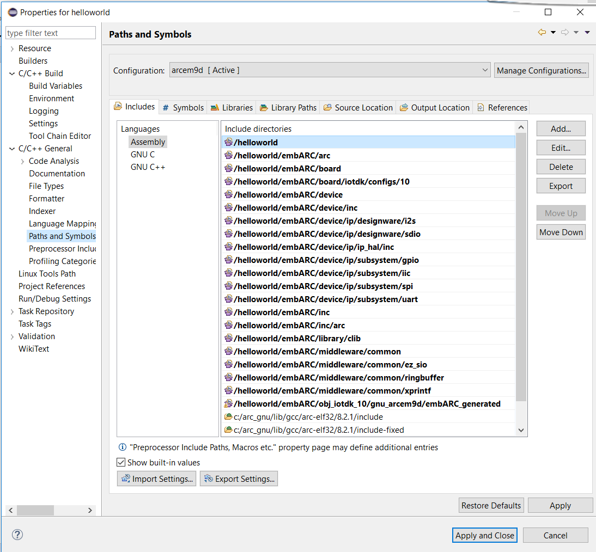

[](https://travis-ci.com/foss-for-synopsys-dwc-arc-processors/embarc_tools) [](https://pypi.org/project/embarc_cli/) [](https://pypi.org/project/embarc_cli/)
## Introduction
embARC CLI is the name of the embARC command-line tool, packaged as `embarc_tools`. embARC CLI support for embARC application creation, build and config, use of the embARC Open Software Platform.

This document covers the installations and usage of embARC CLI.
## Usage
The basic workflow for embARC CLI is to:
1. Create an application.
2. Config the application.
3. Build the application code.

<span class="tips">**Tip:** To list all embARC CLI commands, use `embarc --help`. A detailed command-specific help is available by using `embarc <command> --help`.
```
$ embarc -h
usage: embarc [-h] [--version]             ...

Command-line tool for embARC OSP - https://embarc.org/embarc_osp
version 1.0.4

Use "embarc <command> -h|--help" for detailed help.
Online manual and guide available at https://github.com/foss-for-synopsys-dwc-arc-processors/embarc_tools

optional arguments:
  -h, --help   show this help message and exit
  --version    Display version

Commands:

    new        Create a new application
    build      Build application
    appconfig  Get or set application config
    config     Get, set or unset configuration options.
```
### Installation
Windows and Linux support for embARC CLI.

### Requirements
* **Python** - embARC CLI is a Python script, so you'll need Python to use it. We test embARC CLI with [version 2.7.11 of Python](https://www.python.org/downloads/release/python-2711/) and [version 3.6.0 of Python](https://www.python.org/downloads/release/python-360/)
#### Install embARC CLI
You can get the lastest stable version of embARC CLI through pip by running:
```
$ pip install embarc-cli
```
Alternatively, you can get the development version of embARC CLI by cloning the development repository:
```
$ git clone https://github.com/foss-for-synopsys-dwc-arc-processors/embarc_tools.git
```
Once cloned, you can install embARC CLI as a Python package:
```
$ python setup.py build
$ python setup.py install
```
#### Update embARC CLI
To update an existing installation of embARC CLI, run:
```
$ pip install -U embarc-cli
```
#### Uninstall embARC CLI
```
$ pip uninstall embarc-cli
```
### Before you begin
embARC CLI uses the user directory `Users/xxx/.embarc_cli` to save global settings. When you use embARC CLI, it will create two files:
1. `Users/xxx/.embarc_cli/osp.json` including information about root paths of embARC OSP source code.
2. `Users/xxx/.embarc_cli/global_config.json` including current global settings: `EMBARC_OSP_ROOT`,`TOOLCHAIN` and build configuration `BOARD`, `BD_VER` and `CUR_CORE`.
### Create a new application
embARC CLI can create applications based on embARC Open Software Platform. A detailed command-specific help is available by using `embarc new --help`.

When you create a new application, embARC CLI automatically imports the OSP from global settings if you haven't specify a OSP root path by `--osp_root`, if there is no `EMBARC_OSP_ROOT` in global settings, you need to input manually.

The arguments for `build` are:

- `-d` or `--path` to specify the path of the application.
- `-b` or `--board` to select a board.
- `--bd_ver` to select a board_ver.
- `--core` to select a core.
- `-t` or `--toolchain` to select a toolchain. The value can be `gnu`(GNU) or `mw`(MetaWare).
- `-j` or `--parallel` to compile code in parallel.
- `--target` to select the build target, the default target is `all`, you can selsect one from `[elf, bin, hex, size, opt, info, all, run, clean]`.
- `-g` or `--export` to generate Eclipse IDE project file for your application.
- `--app_config` to specify application configuration with a json file.

Let's create an application named `helloworld` for embARC OSP:
```
$ embarc new helloworld
[embARC] Current osp root is: C:/Users/jingru/Documents/embarc/embarc_osp
[embARC] Support boards : axs  emsk  hsdk  iotdk  nsim
[embARC] Choose board: emsk
[embARC] emsk support versions : 11  22  23
[embARC] Choose board version: 11
[embARC] emsk with versions 11 support cores : arcem4  arcem4cr16  arcem6  arcem6gp
[embARC] choose core: arcem4
[embARC] Support toolchains: gnu  mw
[embARC] Choose toolchain: gnu
[embARC] Current configuration
+------------+-------+--------+----------+-----------+---------------------------------------------+--------+
| APPL       | BOARD | BD_VER | CUR_CORE | TOOLCHAIN | EMBARC_OSP_ROOT                             | OLEVEL |
+------------+-------+--------+----------+-----------+---------------------------------------------+--------+
| helloworld | emsk  | 11     | arcem4   | gnu       | C:\Users\jingru\Documents\embarc\embarc_osp | O3     |
+------------+-------+--------+----------+-----------+---------------------------------------------+--------+
[embARC] Start to generate makefile and main.c
[embARC] Finish generate makefile and main.c, and they are in C:\Users\jingru\Documents\embarc\testcli\helloworld
```
If you want to create an application quickly, you can use `--quick`, it can create application with current global settings.
```
$ embarc new --quick
[embARC] Current osp root is: C:/Users/jingru/Documents/embarc/embarc_osp
[embARC] Current configuration
+------------+-------+--------+----------+-----------+---------------------------------------------+--------+
| APPL       | BOARD | BD_VER | CUR_CORE | TOOLCHAIN | EMBARC_OSP_ROOT                             | OLEVEL |
+------------+-------+--------+----------+-----------+---------------------------------------------+--------+
| helloworld | emsk  | 23     | arcem7d  | gnu       | C:\Users\jingru\Documents\embarc\embarc_osp | O3     |
+------------+-------+--------+----------+-----------+---------------------------------------------+--------+
[embARC] Start to generate makefile and main.c
[embARC] Finish generate makefile and main.c, and they are in C:\Users\jingru\Documents\embarc\testcli\helloworld\helloworld
```
<span class="tips">**Tip:** If you haven't set a global `EMBARC_OSP_ROOT`, it will raise `Can't get osp root from global setting`.
When you create application with `embarc new`, it will generate a file `embarc_app.json` recording the parameters:
```
{
    "APPL": "helloworld", 
    "BOARD": "emsk", 
    "BD_VER": "23", 
    "CUR_CORE": "arcem7d", 
    "TOOLCHAIN": "gnu", 
    "EMBARC_OSP_ROOT": "C:/Users/jingru/Documents/embarc/embarc_osp", 
    "OLEVEL": "O3"
}
```

### Build your application
Use the `embarc build` command to compile your code:
```
$ embarc build
[embARC] Read embarc_app.json
[embARC] Build target: all
[embARC] Current configuration
+------------+-------+--------+----------+-----------+--------+---------------------------------------------+
| APPL       | BOARD | BD_VER | CUR_CORE | TOOLCHAIN | OLEVEL | EMBARC_OSP_ROOT                             |
+------------+-------+--------+----------+-----------+--------+---------------------------------------------+
| helloworld | emsk  | 23     | arcem7d  | gnu       | O3     | C:/Users/jingru/Documents/embarc/embarc_osp |
+------------+-------+--------+----------+-----------+--------+---------------------------------------------+
[embARC] Build command: make BD_VER=23 TOOLCHAIN=gnu OLEVEL=O3 APPL=helloworld BOARD=emsk CUR_CORE=arcem7d all
[embARC] Start to build application
"Creating Directory    : " obj_emsk_23/gnu_arcem7d/application/.
"Creating Directory    : " obj_emsk_23/gnu_arcem7d/arc
"Creating Directory    : " obj_emsk_23/gnu_arcem7d/arc/startup
 ...
"Copy TCF file C:/Users/jingru/Documents/embarc/embarc_osp/board/emsk/configs/23/tcf/arcem7d.tcf to obj_emsk_23/gnu_arcem7d/embARC_generated/arc.tcf"
"Generate Metaware compiler argument file obj_emsk_23/gnu_arcem7d/embARC_generated/ccac.arg"
"Generate ARC GNU compiler argument file obj_emsk_23/gnu_arcem7d/embARC_generated/gcc.arg"
"Generate nSIM properties file obj_emsk_23/gnu_arcem7d/embARC_generated/nsim.props"
"Generate Metaware Debugger argument file obj_emsk_23/gnu_arcem7d/embARC_generated/mdb.arg"
"Generate ARC core config header file obj_emsk_23/gnu_arcem7d/embARC_generated/core_config.h"
"Generate ARC core config assembler file obj_emsk_23/gnu_arcem7d/embARC_generated/core_config.s"
"Generating Linkfile   : " obj_emsk_23/gnu_arcem7d/linker_gnu.ldf
"Compiling             : " main.c
 ...
"Archiving             : " obj_emsk_23/gnu_arcem7d/liblibclib.a
"Archiving             : " obj_emsk_23/gnu_arcem7d/libembarc.a
"Linking               : " obj_emsk_23/gnu_arcem7d/helloworld_gnu_arcem7d.elf
[embARC] Completed in: (79.9449999332)s
```
To run examples in embARC OSP Source code, run `embarc_osp\example\baremetal\ble_rn4020` for instance:
```
$ embarc build run
[embARC] Build target: run
[embARC] Read makefile and get configuration
[embARC] Run command make info
[embARC] Current configuration
+--------+-------+--------+----------+-----------+--------+---------------------------------------------+
| APPL   | BOARD | BD_VER | CUR_CORE | TOOLCHAIN | OLEVEL | EMBARC_OSP_ROOT                             |
+--------+-------+--------+----------+-----------+--------+---------------------------------------------+
| rn4020 | iotdk | 10     | arcem9d  | mw        | O2     | C:/Users/jingru/Documents/embarc/embarc_osp |
+--------+-------+--------+----------+-----------+--------+---------------------------------------------+
[embARC] Build command: make BD_VER=10 TOOLCHAIN=mw OLEVEL=O2 APPL=rn4020 BOARD=iotdk CUR_CORE=arcem9d run
[embARC] Start to build application
"Creating Directory    : " obj_iotdk_10/mw_arcem9d/application/.
"Creating Directory    : " obj_iotdk_10/mw_arcem9d/arc
 ...
 "Compiling             : " ../../../library/clib/embARC_target.c
"Archiving             : " obj_iotdk_10/mw_arcem9d/liblibclib.a
"Archiving             : " obj_iotdk_10/mw_arcem9d/libembarc.a
"Linking               : " obj_iotdk_10/mw_arcem9d/rn4020_mw_arcem9d.elf
"Download & Run obj_iotdk_10/mw_arcem9d/rn4020_mw_arcem9d.elf"
mdb -nooptions -nogoifmain -toggle=include_local_symbols=1 -hard -digilent     -run obj_iotdk_10/mw_arcem9d/rn4020_mw_arcem9d.elf
[DIGILENT] This device supports JTAG7 scan formats.
[DIGILENT] Device enumeration: #0 is `IoTDK'=DesignWare ARC SDP.
[DIGILENT] We choose device  : #0 `IoTDK' from 1 possible devices.
[DIGILENT] Product=507 variant=1 fwid=56 firmware-version=10f.
[DIGILENT] It is possible to set the JTAG speed.
[DIGILENT] Current speed is 10000000 Hz.
[DIGILENT] Suppress these messages with environment variable DIG_VERBOSE=0.
SmaRT Build Configuration Register: 0x10003 (stack size=64)
```
The Tera Term output:
```
-----------------------------------------------------------
 ____                                _ ____
|  _ \ _____      _____ _ __ ___  __| | __ ) _   _
| |_) / _ \ \ /\ / / _ \ '__/ _ \/ _` |  _ \| | | |
|  __/ (_) \ V  V /  __/ | |  __/ (_| | |_) | |_| |
|_|   \___/ \_/\_/ \___|_|  \___|\__,_|____/ \__, |
                                             |___/
                     _       _    ____   ____
       ___ _ __ ___ | |__   / \  |  _ \ / ___|
      / _ \ '_ ` _ \| '_ \ / _ \ | |_) | |
     |  __/ | | | | | |_) / ___ \|  _ <| |___
      \___|_| |_| |_|_.__/_/   \_\_| \_\\____|
------------------------------------------------------------

embARC Build Time: Jan 18 2019, 16:18:26
Compiler Version: Metaware, 4.2.1 Compatible Clang 6.0.1 (branches/release_60)
n4020 test application
state: INITIALIZING
rx:CMD
state: READY
state: WAITING_FOR_AOK
tx: SF,1
rx:AOK
state: READY
state: WAITING_FOR_AOK
tx: SN,embARC
rx:AOK
state: READY
state: WAITING_FOR_AOK
 ...
service uuid, skip it
rx:  000102030405060708090A0B0C0D0E0F,001B,02,05
rx:  000102030405060708090A0B0C0D0E0F,001C,10,02
rx:  101112131415161718191A1B1C1D1E1F,001E,0A,05
rx:END
state: READY
state: WAITING_FOR_AOK
rx:AOK
state: READY
```
You can specify parameters in two ways:
1. Use `--xxx`:
```
$ embarc build  --board iotdk --bd_ver 10 --core arcem9d --target all
[embARC] Read embarc_app.json
[embARC] Build target: all
[embARC] Current configuration
+------------+-------+--------+----------+-----------+--------+---------------------------------------------+
| APPL       | BOARD | BD_VER | CUR_CORE | TOOLCHAIN | OLEVEL | EMBARC_OSP_ROOT                             |
+------------+-------+--------+----------+-----------+--------+---------------------------------------------+
| helloworld | iotdk | 10     | arcem9d  | gnu       | O3     | C:/Users/jingru/Documents/embarc/embarc_osp |
+------------+-------+--------+----------+-----------+--------+---------------------------------------------+
[embARC] Build command: make BD_VER=10 TOOLCHAIN=gnu OLEVEL=O3 APPL=helloworld BOARD=iotdk CUR_CORE=arcem9d all
[embARC] Start to build application
"Creating Directory    : " obj_iotdk_10/gnu_arcem9d/application/.
 ...
"Copy TCF file C:/Users/jingru/Documents/embarc/embarc_osp/board/iotdk/configs/10/tcf/arcem9d.tcf to obj_iotdk_10/gnu_arcem9d/embARC_generated/arc.tcf"
"Generate Metaware compiler argument file obj_iotdk_10/gnu_arcem9d/embARC_generated/ccac.arg"
"Generate ARC GNU compiler argument file obj_iotdk_10/gnu_arcem9d/embARC_generated/gcc.arg"
"Generate nSIM properties file obj_iotdk_10/gnu_arcem9d/embARC_generated/nsim.props"
"Generate Metaware Debugger argument file obj_iotdk_10/gnu_arcem9d/embARC_generated/mdb.arg"
"Generate ARC core config header file obj_iotdk_10/gnu_arcem9d/embARC_generated/core_config.h"
"Generate ARC core config assembler file obj_iotdk_10/gnu_arcem9d/embARC_generated/core_config.s"
"Generating Linkfile   : " obj_iotdk_10/gnu_arcem9d/linker_gnu.ldf
"Compiling             : " main.c
"Compiling             : " C:/Users/jingru/Documents/embarc/embarc_osp/board/board.c
"Compiling             : " C:/Users/jingru/Documents/embarc/embarc_osp/arc/startup/arc_cxx_support.c
 ...
"Archiving             : " obj_iotdk_10/gnu_arcem9d/liblibclib.a
"Archiving             : " obj_iotdk_10/gnu_arcem9d/libembarc.a
"Linking               : " obj_iotdk_10/gnu_arcem9d/helloworld_gnu_arcem9d.elf
[embARC] Completed in: (97.7479999065)s
```
2. Use `BOARD=iotdk BD_VER=10 CUR_CORE=arcem9d clean`, this is the default format when you build with `make` command:
```
$ embarc build BOARD=iotdk BD_VER=10 CUR_CORE=arcem9d clean
[embARC] Read embarc_app.json
[embARC] Build target: clean
[embARC] Current configuration
+------------+-------+--------+----------+-----------+--------+---------------------------------------------+
| APPL       | BOARD | BD_VER | CUR_CORE | TOOLCHAIN | OLEVEL | EMBARC_OSP_ROOT                             |
+------------+-------+--------+----------+-----------+--------+---------------------------------------------+
| helloworld | iotdk | 10     | arcem9d  | gnu       | O3     | C:/Users/jingru/Documents/embarc/embarc_osp |
+------------+-------+--------+----------+-----------+--------+---------------------------------------------+
[embARC] Build command: make BD_VER=10 TOOLCHAIN=gnu OLEVEL=O3 APPL=helloworld BOARD=iotdk CUR_CORE=arcem9d clean
[embARC] Start to build application
"Clean Workspace For Selected Configuration : iotdk_10-gnu_arcem9d"
C:\WINDOWS\system32\cmd.exe /C if exist  obj_iotdk_10\gnu_arcem9d   C:\WINDOWS\system32\cmd.exe /C rd /S /Q obj_iotdk_10\gnu_arcem9d
C:\WINDOWS\system32\cmd.exe /C if exist  .sc.project   C:\WINDOWS\system32\cmd.exe /C rd /S /Q .sc.project
[embARC] Completed in: (1.96500015259)s
```

<span class="tips">**Tip:** embARC defines different build targets for selected configuration. A detailed command-specific help is available by using `make --help`. You can specify a target : 
1. `embarc build --target xxx`.
2. `embarc build [other paramters] xxx`, embARC CLI will choose the last parameter as target.

#### Export Eclipse IDE file
If you need to debug your code, you can export your source tree to IDE project file to use the IDE's debugging facilities. embARC CLI supports exporting to Eclipse using GNU or MetaWare.

For example:
```
$ embarc build  --export
[embARC] Read embarc_app.json
[embARC] Current configuration
+------------+-------+--------+----------+-----------+--------+---------------------------------------------+
| APPL       | BOARD | BD_VER | CUR_CORE | TOOLCHAIN | OLEVEL | EMBARC_OSP_ROOT                             |
+------------+-------+--------+----------+-----------+--------+---------------------------------------------+
| helloworld | iotdk | 10     | arcem9d  | gnu       | O3     | C:/Users/jingru/Documents/embarc/embarc_osp |
+------------+-------+--------+----------+-----------+--------+---------------------------------------------+
[embARC] Start to generate IDE project
[embARC] Run command [make opt]
[embARC] Get inculdes and defines
[embARC] Start to generate IDE project accroding to templates (.project.tmpl and .cproject.tmpl)
[embARC] Finish generate IDE project and the files are in C:\Users\jingru\Documents\embarc\testcli\helloworld
[embARC] Open ARC GNU IDE (version) Eclipse - >File >Open Projects from File System >Paste
C:\Users\jingru\Documents\embarc\testcli\helloworld
```
- Open **ARC GNU IDE 2018.09 Eclipse**, click **File -> Open Projects from File System** .
- Paste `C:\Users\jingru\Documents\embarc\testcli\helloworld` to **Import source**, and click **Finish**.You can your project in **Project Explorer** view.

  

- From the **Project Explorer** view, right-click the project name `helloworld`, select **Properitise** and click **C/C++ Build**, you can see the build settings.

  
  
  Click **C/C++ General -> Paths and Symbols**.
  
  

- Click the **Run > Debug Configurations...** menu option. The Debug Configurations dialog opens.
- Click **helloworld-arcem9d**, you can see that data is automatically entered, take a moment to verify its accuracy or change as needed.
  
  

- Click **Debug**. You may be prompted to switch to the Debug perspective. Click **Yes**.

  

### embARC CLI configuration
The embARC CLI provides a flexible mechanism for configuring the embARC program. You can use it to set, get, update or unset embARC build configuration options. These options can be global or local (per program).

#### Global configuration
Currently supported options: `osp`, `toolchain`, `build_cfg`. A detailed command-specific help is available by using `embarc config --help`.

You can use `embarc config osp` to config the `EMBARC_OSP_ROOT`.
The commands for `embarc config osp` are:

- `embarc config osp --add <name> <url/path> [<dest>]` to add `EMBARC_OSP_ROOT` to a global file `osp.json`. This file is save in current user folder. Parameter `<url/path>` can be: HTTPS URL, local path or zip file path.
- `embarc config osp --rename <oldname> <newname>` to rename a `EMBARC_OSP_ROOT`.
- `embarc config osp --remove <name>` to remove the path from `osp.json`.
- `embarc config osp --list` to show all recorded paths.
- `embarc config osp --set <name>` to set a path as global `EMBARC_OSP_ROOT`.

Add a `EMBARC_OSP_ROOT` for instance:
```
$ embarc config osp --add new_osp https://github.com/foss-for-synopsys-dwc-arc-processors/embarc_osp.git
[embARC] Start clone embarc_osp
[embARC] Finish clone embarc_osp
[embARC] Add (C:\Users\jingru\Documents\embarc\testcli\embarc_osp) to user profile osp.json
```


This command will clone the embARC Source code from github, if the folder `new_osp` does't exist in current path. You can specify another path to clone the source code by:
```
$ embarc config osp --add new_osp https://github.com/foss-for-synopsys-dwc-arc-processors/embarc_osp.git another_path
```
All paths is to look for `Users/xxx/.embarc_cli/osp.json`.
```
osp.json
{
    "embarc_osp": {
        "directory": "C:/Users/jingru/Documents/embarc/embarc_osp", 
        "source": "https://github.com/foss-for-synopsys-dwc-arc-processors/embarc_osp.git", 
        "type": "git"
    }, 
    "embarc": {
        "directory": "C:/Users/jingru/Documents/embarc/testcli/helloworld/embarcnew", 
        "source": "https://github.com/foss-for-synopsys-dwc-arc-processors/embarc_osp.git", 
        "type": "git"
    }, 
    "new_osp": {
        "directory": "C:/Users/jingru/Documents/embarc/testcli/new_osp", 
        "source": "https://github.com/foss-for-synopsys-dwc-arc-processors/embarc_osp.git", 
        "type": "git"
    }
}
```
To see all recorded `EMBARC_OSP_ROOT`, run:
```
$ embarc config osp --list
  embarc_osp
    directory: C:/Users/jingru/Documents/embarc/embarc_osp
    source: https://github.com/foss-for-synopsys-dwc-arc-processors/embarc_osp.git
    type: git

  embarc
    directory: C:/Users/jingru/Documents/embarc/testcli/helloworld/embarcnew
    source: https://github.com/foss-for-synopsys-dwc-arc-processors/embarc_osp.git
    type: git

  new_osp
    directory: C:/Users/jingru/Documents/embarc/testcli/new_osp
    source: https://github.com/foss-for-synopsys-dwc-arc-processors/embarc_osp.git
    type: git
```
To rename a `EMBARC_OSP_ROOT`, run:
```
$ embarc config osp --rename embarc rename
[embARC] Start rename embarc to rename
  rename
    directory: C:/Users/jingru/Documents/embarc/testcli/helloworld/embarcnew
    source: https://github.com/foss-for-synopsys-dwc-arc-processors/embarc_osp.git
    type: git

  embarc_osp
    directory: C:/Users/jingru/Documents/embarc/embarc_osp
    source: https://github.com/foss-for-synopsys-dwc-arc-processors/embarc_osp.git
    type: git

  new_osp
    directory: C:/Users/jingru/Documents/embarc/testcli/new_osp
    source: https://github.com/foss-for-synopsys-dwc-arc-processors/embarc_osp.git
    type: git
```
To remove a `EMBARC_OSP_ROOT`, run:
```
$ embarc config osp --remove rename
[embARC] Start remove rename
  embarc_osp
    directory: C:/Users/jingru/Documents/embarc/embarc_osp
    source: https://github.com/foss-for-synopsys-dwc-arc-processors/embarc_osp.git
    type: git

  new_osp
    directory: C:/Users/jingru/Documents/embarc/testcli/new_osp
    source: https://github.com/foss-for-synopsys-dwc-arc-processors/embarc_osp.git
    type: git
```

You can use `embarc config toolchain` to config `TOOLCHAIN`. Currently supported toolchains are GNU and MetaWare.

You can check the current toolchain in your platform.
```
$ embarc config toolchain gnu
[embARC] Current GNU verion: 2019.03
```
 If you haven't installed the GNU yet, it will remind you to download it, using `--version` to specify the version number. embARC CLI doesn't support for downloading MetaWare.

To set global build configuration, use `embarc config build_cfg`:
```
$ embarc config build_cfg BOARD emsk
[embARC] Set BOARD = emsk as global setting

$ embarc config build_cfg BD_VER 23
[embARC] Set BD_VER = 23 as global setting

$ embarc config build_cfg CUR_CORE arcem7d
[embARC] Set CUR_CORE = arcem7d as global setting
```
#### Local configuration (per program)
You can use `embarc appconfig` to set the program build configuration.
The arguments for `build` are:

- `-a` or `--application` to specify the path of the application.
- `-b` or `--board` to select a board.
- `--bd_ver` to select a board_ver.
- `--cur_core` to select a core.
- `-t` or `--toolchain` to select toolchain. The value can be `gnu`(GNU) or `mw`(MetaWare).
- `-j` or `--parallel` to compile code in parallel.
- `--target` to select the build target, the default target is `all`, you can selsect one from `[elf, bin, hex, size, all]`.
- `--osp_root` to select a path as `EMBARC_OSP_ROOT`.
- `--olevel` to specify the `OLEVEL`.

To see current application configuration, run:
```
$ embarc appconfig
[embARC] Read makefile and get configuration
[embARC] Read embarc_config.json
[embARC] Current configuraion
+-----------------+---------------------------------------------+
| option          | value                                       |
+-----------------+---------------------------------------------+
| APPL            | helloworld                                  |
| BOARD           | iotdk                                       |
| BD_VER          | 10                                          |
| CUR_CORE        | arcem9d                                     |
| TOOLCHAIN       | gnu                                         |
| EMBARC_OSP_ROOT | C:/Users/jingru/Documents/embarc/embarc_osp |
| OLEVEL          | O3                                          |
+-----------------+---------------------------------------------+
```
To change current application configuration. For example, update configuration to `BOARD=emsk BD_VER=11 CUR_CORE=arcem4`, run:
```
$ embarc appconfig --board emsk --bd_ver 11 --cur_core arcem4
[embARC] Read makefile and get configuration
[embARC] Read embarc_config.json
[embARC] Current configuraion
+-----------------+---------------------------------------------+
| option          | value                                       |
+-----------------+---------------------------------------------+
| APPL            | helloworld                                  |
| BOARD           | emsk                                        |
| BD_VER          | 11                                          |
| CUR_CORE        | arcem4                                      |
| TOOLCHAIN       | gnu                                         |
| EMBARC_OSP_ROOT | C:/Users/jingru/Documents/embarc/embarc_osp |
| OLEVEL          | O3                                          |
+-----------------+---------------------------------------------+
```